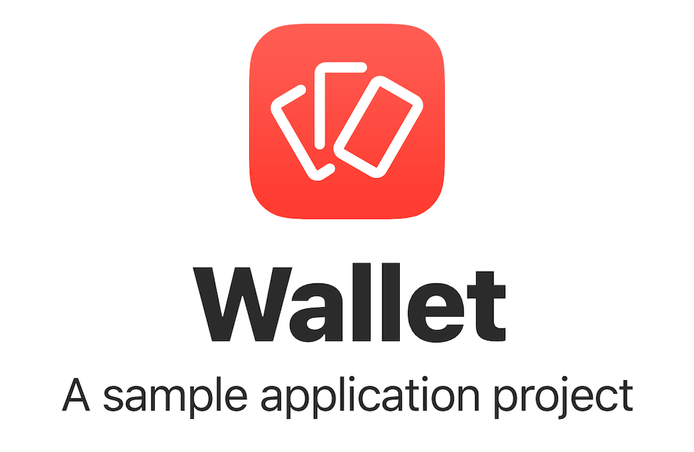
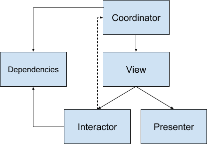
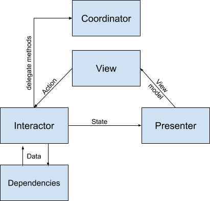

<p align="center"></p>

Wallet is an example of what you can achieve using VIP and Coordinator architectural patterns, together with a little 🕊 RxSwift magic ✨. Enjoy!

### Features
- 🖼 VIP architectural pattern
- 👨‍✈️ [Coordinator](http://khanlou.com/2015/10/coordinators-redux/) architectural pattern
- 🕊 [RxSwift](https://github.com/ReactiveX/RxSwift)
- 🚀 [fastlane](https://fastlane.tools)
- 🌊 [Fluid animations](https://developer.apple.com/videos/play/wwdc2018/803/)
- ☝️ [LocalAuthentication](https://developer.apple.com/documentation/localauthentication)
- 🌚 Night Mode
- 🤷‍ Minimal external dependencies (RxSwift only)

### Future evolutions
- 📙 Database Service using [GRDB.swift](https://github.com/groue/GRDB.swift)
- ⚡ [Haptics](https://developer.apple.com/documentation/uikit/animation_and_haptics)

## Project Setup

Install Xcode Command Line Tools.

	xcode-select --install

Alternatively, you can download the Xcode Command Line Tools installer from the [Apple Developer Website](https://developer.apple.com/downloads/more).

Install Bundler.

	gem install bundler


Install Ruby dependencies.

	bundle install  

Install pods.

	bundle exec pod install

Optional - setup fastlane match.

	bundle exec fastlane match development
	bundle exec fastlane match appstore

For more information about `bundle exec` open [Using a Gemfile on cocoapods.org](https://guides.cocoapods.org/using/a-gemfile.html). 

For more information about `match` open [fastlane match git repo](https://docs.fastlane.tools/actions/match/).

## Compatibility

Wallet is built in **Swift 4.2**. Therefore you must use Xcode 10 when working with this version of wallet.

## Documentation
A mobile application development usually starts from a mockup, containing the flow of the app view by view, and a specification document containing the app features. Starting from the mockup we can easily divide the app into scenes, where each scene represents a full screen view, while starting from the spec document we can define what data is being manipulated and how. A clear separation of the data layer from the scenes layer with a clear interface allows to develop them indipendently, to easily mock services and to test thoroughly every part of the app. We identified some basic architectural components to guide the development and keep the concerns separated. Keep in mind that these are only guidelines that can be adapted to each project depending on its complexity (i.e.: you should't create a 6 components architecture for a project printing 'hello world' to the console...).

### Scenes
A typical scene is divided in 3 layers: the view layer, the control layer and the navigation layer. Below the scenes there is the service layer which provides data and data manipulation features to the app.
The following image explains the ownership (weak/strong) relations between the objects composing a scene.

<p align="center"></p>

#### View Layer
The view layer is provided by the view controller. It holds and controls views and animations, and defines its inputs and outputs through input and output protocols. The input and output protocols will be implemented by the presenter and the interactor (as explained in the next paragraph). The inputs are tipically a set of drivers emitting the view models to configure the views or triggering animations. The view controller should subscribe to those drivers or bind them directly to the views when possible. The output protocol tipically exposes an observer of the events coming from the user. Those events are tipically modeled with an enum type with a case for each event or action.

#### Control Layer
The control layer is provided by the controller objects. The controller objects implement the inputs and the outputs of the view controller and realize the business logic and the state management with the help of the service layer. The controller objects are the interactor, which implements the view controller outputs, and a presenter, which implements the view controller inputs. 

##### Interactor
The interactor will transform the events coming from the view controller into updates of the current state, optionally combining them with data and events coming from the dependencies. The process just described is modeled in the RxStateful protocol which helps to realize state and side effects management in a centralized and controlled fashion. The RxStateful protocol automatically manages the plumbing of the events flow and allows to implement the business logic by overriding some of its methods:
- The transform(action) method is used to combine an action with other events from outside the scene.
- The mutate(action) handles each action performing side-effects such as async tasks through workers or services and eventually commits one or more state mutations.
- The transform(mutation) gives you the chance to handle a mutation or combine it with other events before its finally committed.
- The reduce(state,mutation) method generates a new state with the previous state and the mutation. It should be purely functional so it should not perform any side-effects here. This method is called every time a mutation is committed.
- The transform(state) method allows to transform the state stream. Usually this function is used to perform side-effects such as logging.

The following image shows what data is passed between the objects composing a scene:

<p align="center"></p>

The logic implemented in the interactor should be isolated into pure functions as much as possible and those functions should be used just in the RxStateful methods. Sometimes different scenes share some business logic. To avoid duplicating those behaviors in each scene you could create a dedicated class, called Worker, which simply embeds the functions and is used by different scenes. Workers should fulfill a single purpose and are stateless.

##### Presenter
The presenter will receive the state updates from the interactor as an observable sequence and will map the sequence into the differend drivers. Tipically helper methods are used to create the view models from the state object so that they are easily tetable.

#### Coordinator
The navigation layer is provided by the coordinator. A coordinator is an object that instantiates, configures and displays one or more view controllers relative to a single scene, implementing all the driving logic. A coordinator presents/pushes/sets its children coordinators by presenting/pushing/setting their view controllers on its own view controller. The coordinator receives commands from the interactor which implements the coordinator input protocol.

### Data Layer

#### Services
The service layer provides data and data manipulation features to the app. Each service is usually a singleton held by and AppDependenciesProvider object which allows to provide to each scene just the services it needs through protocol composition. Each service should be indipendend from other services and from scenes. Services are used by interactors and sometimes by coordinators (when the data from a service determines the app navigation).

#### Managers
Sometimes the state of an application cannot be confined in a single scene, and sometimes different scenes depend upon a more general, app-wide state. This state is managed by Manager objects. Managers can depend on other services but are owned by the same AppDependenciesProvider and can be injected in the scenes just like normal services.

## Advanced Configuration
By default the lisca project template provides two build configurations (debug and release) and a single build scheme which runs with the debug configuration and archives with the release configuration.
If you need to add a test environment you should:
- [Create two new build configurations](https://stackoverflow.com/a/19882062/7641654): 'Debug-test' by copying the 'Debug' configuration and 'Release-test' by copying the 'Release' configuration.
- Configure the new configurations with the desired parameters (test server url, test keys, development team)
- Create a new build scheme and set it to run with the Debug-test configuration and to archive with the Release-test configuration.

With this configuration in place you can run and archive applications with test or production environments and switch from one to the other simply by selecting the scheme in the Xcode top bar, next to the stop button.

## Deployment

### App Store Deployment

To deploy a build to App Store Connect (TestFlight and App Store) use the `release` lane. Navigate to your project folder and run:
```
bundle exec fastlane release version_number:{the version we are developing} username:{your@apple.id} from_commit{commit id of the previous tag} build_tag:{current tag}
```

For more information about fastlane open [fastlane documentation](https://docs.fastlane.tools).

- If `username` parameter is not provided it will be asked.
- If `version_number` parameter is not provided the project's version and build numbers will be used.
- If `version_number` is provided and `build_number` is not provided the script will read and increment the last TestFlight build number for the specified version from App Store Connect.
- If you have different AppleIDs for App Store Connect and the Apple Developer portal you can use the `username` option for the App Store Connect AppleID and the `devusername` option for the Apple Developer portal AppleID.
- If `build_tag` is provided you have to create a git tag with the same name first.
- The TestFlight build changelog is automatically compiled with the commit messages from the previous tag to the `build_tag` (if specified) or to the `HEAD`. If you want to specify a commit to start from use the `from_commit` option.
